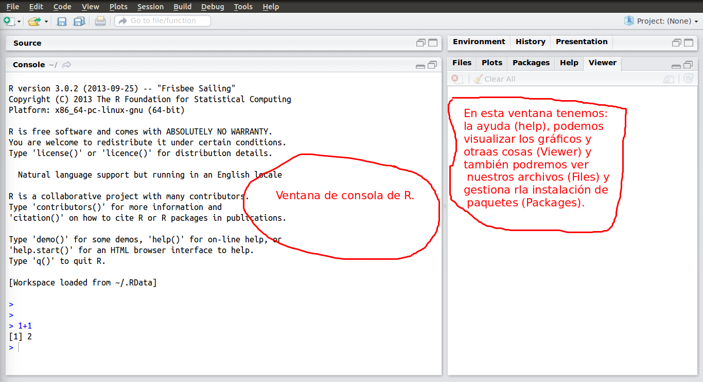
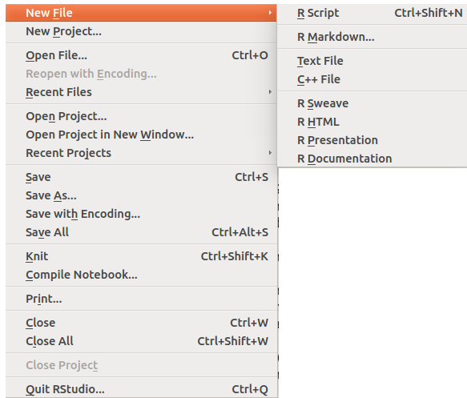
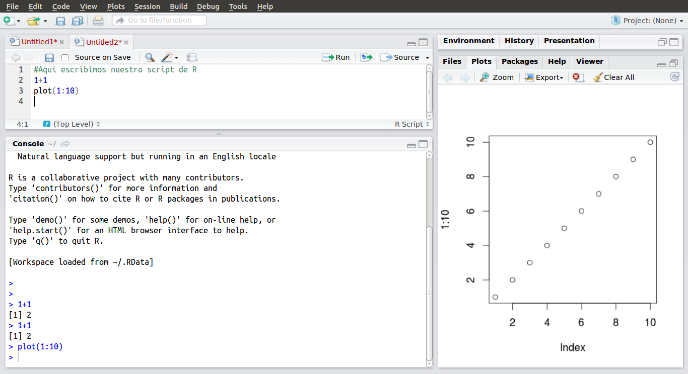

Rápida introducción a RStudio y a Rmarkdown
==================================================

Para empezar
--------------------------------------------------------

Antes de empezar lo que tenéis que hacer es instalar en vuestro ordenador personal:

* Una [versión reciente de R](http://cran.es.r-project.org/). 
* La [última versión de Rstudio Desktop v0.98.1073](http://www.rstudio.com/products/rstudio/download/)
* Si queréis todas las funcionalidades deberéis instalar algunos programas adicionales como [TeX/LaTeX](http://latex-project.org/ftp.html).
* Los demás programas necesarios suelen estar instalados en un ordenador personal.

Si ya teníais una versión de R o de Rstudio debéis actualizarla. Algunos de los programas que utilizaremos son muy recientes y sólo se instalaran (en particular Rmarkdown) si os actualizáis a una versión de Rstudio Desktop >= v0.98.1073.

Rstudio básico
--------------------------------------------------------

Los autores de [RStudio](http://www.rstudio.com/), entre otras cosas, nos proporcionan el programa RStudio Desktop que es un entorno de desarrollo integrado (*IDE*).  Es decir es un entorno de programación que consiste en un editor de código, utilidades de compilación (ejecución de código), etc. Vamos que es la más exitosa interfaz gráfica  de usuario (*GUI*) que nos permite trabajar  de forma cómoda con R. 

Además dispone de una serie de utilidades para la generación de informes de una forma ágil y sencilla.

En en la propia web de Rstudio tenéis unos fantásticos manuales sobre esta aplicación.

Aquí explicamos lo más básico, lo demás lo aprenderéis de forma intuitiva o leyendo las lecciones del cursos, los manuales y consultando con los
compañeros en los foros.


Esta es, posiblemente, la primera vista de RStudio



En el menú File podéis abrir un R Script (y entre otras cosas un fichero de Rmarkdown)  como se ve en el siguiente gráfico



La situación después de abrir  un R Script es la siguiente





Rmarkdown básico
--------------------------------------------------------
Para lo que queremos que aprendáis este curso el *Markdown Quick Reference* es suficiente. Pero os tenemos que ayudar un poco más con las fórmulas matemáticas, el formato que se puede dar a
las *chunks* de R.


Fórmulas matemáticas en R markdown <a name="dos"/>
--------------------------------------------------------

La manera de introducir fórmulas matemáticas en `R Markdown` sigue una sintaxis similar a la de del sistema de composición de textos científicos LaTeX. Si habéis utilizado Moodle
seguramente habréis visto  utilizar a algunos alumnos y profesores esta menera de escribir en fórmulas. De hecho esta capacidad la tiene Moodle pues tiene activado su propio lenguaje markdown.

No tiene ningún misterio. Solo tenemos que introducir un código que representa la fórmula de dos formas:

1. Para las fórmulas o ecuaciones en una misma línea (*inline equations*) se pone el código entre dos dobles dólares: `$código$`
2. Para las fórmulas o ecuaciones entre líneas  (*display equations*) se pone el código entre dos dólares: `$$código$$` 


A continuación se muestran algunos ejemplos de código:

## Fórmulas<a name="dos.uno"/>

__Letras griegas, símbolos y acentos matemáticos__

* Código: `$\mu, \beta, \lambda, \sigma, \Sigma$`
 * Salida:  $\mu,\beta,\lambda,\sigma,  \Sigma$
* Código: `$\tilde{S}, \overline{x},  \overline{X}, \hat{p}$`
 * Salida:   $\tilde{S}, \overline{x},  \overline{X}, \hat{p}$
* Código: `$\infty, -\infty,  +\infty, \pm\infty$`
 * Salida:   $\infty, -\infty,  +\infty, \pm\infty$


Subíndices, superíndices, comparaciones:

* Código: `$x_{i}$`
 * Salida:  $x_{i}$
* Código: `$x^{25}$`
 * Salida:   $x^{25}$
* Código: `$x_{i j}$`
 * Salida:  $x_{i j}$
* Código: `$x^{2\cdot \alpha}, \tilde{S}^2,\sqrt{x}$`
 * Salida:  $x^{2\cdot \alpha}, \tilde{S}^2, \sqrt{x}$
* Código: `$\mu=\mu_{0}$`
 * Salida:  $\mu=\mu_{0}$
* Código: `$3.141516\approx 3.14$`
 * Salida:  $3.141516\approx 3.14$
* Código: `$\mu\neq \mu_{0}$`
 * Salida:  $\mu\neq \mu_{0}$
* Código: `$\mu > \mu_{0}, \mu\geq \mu_{0}$`
 * Salida:  $\mu > \mu_{0}, \mu\geq \mu_{0}$
* Código: `$\mu < \mu_{0}, \mu\leq \mu_{0}$`
 * Salida:  $\mu < \mu_{0}, \mu\leq \mu_{0}$

__Fracciones__
* Código: `$\frac{\alpha}{2}$`
 * Salida:  $\frac{\alpha}{2}$
* Código: `$z_{1-\frac{\alpha}{2}}, 8^{\frac{1}{3}}$`
 * Salida: $z_{1-\frac{\alpha}{2}}, 8^{\frac{1}{3}}$
* Código: `$\frac{\tilde{S}}{\sqrt{n}}$`
 * Salida: $\frac{\tilde{S}}{\sqrt{n}}$

__Paréntesis, corchetes y llaves__:

* Simples. Código: `$(a,b); ]a,b[; \{a,b\}$`
 * Salida:  $(a,b); ]a,b[; \{a,b\}$
* Que se adaptan al tamaño `\left(\right)`,`\left]\right]`... 

Código: 
 
```
$\left[\overline{X} -z_{1-\frac{\alpha}{2}} \frac{\sigma}{\sqrt{n}}, \overline{X}+z_{1-\frac{\alpha}{2}}\frac{\sigma}{\sqrt{n}}
\right]$
```
Salida: 
  
$$\left[\overline{X} -z_{1-\frac{\alpha}{2}} \frac{\sigma}{\sqrt{n}}, \overline{X}+z_{1-\frac{\alpha}{2}}\frac{\sigma}{\sqrt{n}}
\right]$$

## Matrices <a name="dos.dos"/>
Las matrices se definen empezando con `\begin{array}{lcr}` y acabando con `\end{array}`. La letras `lcr` entre llaves indican
tanto el número de columnas como si se alinean a izquierda (**l**eft), derecha (**r**ight) o quedan centradas (**c**enter). Entre el `\begin{array}{lcl}` y el `\end{array}` se introducen por filas los valores de la matriz separados por el símbolo `&` y el cambio de fila se indica con `\\`. En principio las matrices contienen fórmulas. Si queremos introducir texto en una fórmula tenemos que crear una caja de texto con la instrucción `\mbox{ pon aquí tu texto}` (`mbox` es el la abreviatura de *make a box*)


```
$
\left(
\begin{array}{ll}
123 & 4 \\
1   & 234
\end{array}
\right)
$
```


Salida:

$$
\left(
\begin{array}{ll}
123 & 4 \\
1   & 234
\end{array}
\right)
$$


```
$
\left\{
\begin{array}{ll}
123 & 4 \\
1   & 234\mbox{ dato atípico}
\end{array}
\right\}
$

```
Salida:

$$
\left\{
\begin{array}{ll}
123 & 4  \\
1   & 234 \mbox{ dato atípico}
\end{array}
\right\}
$$

Si queremos eliminar una llave del lado derecho hay que escribir 
```
\left\{\right.
```
*Notad que el punto de* `\right.` es el que indica se tiene que omitir la llave (o paréntesis o corchete) derecha. Por ejemplo
```
$$
\left\{
\begin{array}{ll}
123 & 4  \\
1   & 234 \mbox{ dato atípico}
\end{array}
\right.
$$
```
Salida:

$$
\left\{
\begin{array}{ll}
123 & 4  \\
1   & 234 \mbox{ dato atípico}
\end{array}
\right.
$$


## Contrastes de hipótesis <a name="dos.tres"/>
Ahora unas plantillas ejemplo para escribir los contrastes de hipótesis:


En la misma línea que el texto. 

* Código:
Contrastaremos la hipótesis nula `$H_{0}: \mu=\mu_0$` contra la alternativa bilateral `$H_{1}: \mu\neq\mu_0$`. 

 * Salida:
Contrastaremos la hipótesis nula $H_{0}: \mu=\mu_0$ contra la alternativa bilateral $H_{1}: \mu\neq\mu_0$. 

Con el modo *fórmulas entre líneas*

Código:
Vamos a realizar el siguiente contraste
```
$$
\left\{
\begin{array}{ll}
H_{0}: &  \mu=\mu_0\\
H_{1}: & \mu\neq\mu_0
\end{array}
\right.
$$
```
Salida:

Vamos a realizar el siguiente contraste

$$
\left\{
\begin{array}{ll}
H_{0}: &  \mu=\mu_0\\
H_{1}: & \mu\neq\mu_0
\end{array}
\right.
$$


Parámetros de las *chunks* de R <a name="indice"/>
--------------------------------------------------------
Sabemos que las *chunks* de R se indican 

```
```{r}
x=1+1  
x 
```
```

La parte entre  llaves que empieza por r puede contener diversos parámetros que son opcionales. Por ejemplo

&#96;&#96;&#96;
```{r etiqueta, echo=TRUE,results='hide'}  
x=1+1  
x
```
&#96;&#96;&#96;

NUEVO
</p>
<pre class="code"><code>```{r chunkLabel}
# R code
```</code></pre>
<p>

La primera es una etiqueta o nombre que tendrá la *chunk*, y está formada por un blanco que lo separa de la r seguido por una cadena de caracteres sin blancos, las demás opciones viene separadas por comas. Si no se desea poner etiqueta y sí opciones se pone &#96;&#96;&#96;{r , opciones}.

* La opción `echo`  es lógica e indica si se muestra (`TRUE` que es valor por defecto) o no (`FALSE`) el código fuente de R. 
* La opción `results` a la que podemos asignar: 
  * El valor 'markup' que es la opción por defecto y muestra los resultados en el documento
  * El valor 'hide' que no muestra los resultados.
  * Dispone de otros valores que no comentamos.
 
Los siguientes ejemplos ilustran el comportamiento de estas opciones

La opción por defecto es la que **muestra todo**, tanto el código como los  resultados.

&#96;&#96;&#96;{r todo_se_ve, echo=TRUE,results='markup'}`  
x=1+1  
x  
&#96;&#96;&#96;

```{r todo_se_ve, echo=TRUE,results='markup' } 
x=1+1
x
```

Para que se vea **solamente el código**

&#96;&#96;&#96;{r solo_codigo, echo=TRUE,results='hide'}  
x=1+1  
x  
&#96;&#96;&#96; 

```{r solo_codigo, echo=TRUE,results='hide'}  
x=1+1
x
```


Para que se vean *solamente los resultados* y no el código

&#96;&#96;&#96;{r solo_resultados, echo=FALSE,results='markup'}  
x=1+1  
x  
&#96;&#96;&#96; 

```{r solo_resultados, echo=FALSE,results='markup'}
x=1+1 
x 
```

Para que *no se vea nada*, ni el resultado ni el código

&#96;&#96;&#96;{r no_se_ve_nada, echo=FALSE,results='hide'}  
x=1+1  
x  
&#96;&#96;&#96; 

```{r no_se_ve_nada, echo=FALSE,results='hide'}
x=1+1
x
```

Y como se ve no se ve nada:-)

Las *chunks* en modo línea <a name="cuatro"/>
------------------------------------------------------------------

Las *chunks* que hemos visto hasta ahora no permiten introducir resultados dentro de una línea de texto. La sintaxis de Rmarkdown para insertar resultados de código en una línea es 
&#96;r código &#96;.

Por ejemplo la  **entrada** 

El cubo de dos  es   &#96;r 2^3  &#96;. O lo que es lo mismo 
`$2^3$=`  &#96;r 2^3  &#96;

produce la **salida**

El cubo de dos es `r 2^3`. O lo que es lo mismo 
$2^3$=`r 2^3`

Veamos un ejemplo más práctico. Nos dan una muestra y nos piden calcular la media, la varianza, la desviación típica y el tamaño muestral. Primero cargamos los datos y hacemos los cálculos con una *chunk*

```{r}
muestra=c(1,2,3,NA,2.8,3.1,4.9)
muestra
media=mean(muestra,na.rm=TRUE)
media
var=var(muestra,na.rm=TRUE)
var
desv.tipica=sd(muestra,na.rm=TRUE)
desv.tipica
n=length(na.omit(muestra))
n
```

El siguiente **código de entrada** 
```{r  ,eval=FALSE}
La muestra es de tamaño $n$=`r n`, su media es $\overline{x}$ =`r media`,
su varianza es $\tilde{s}\^2$=`r var` y su desviación típica es  $\tilde{s}$=`r desv.tipica`.
```

produce la **salida**

La muestra es de tamaño $n$=`r n`, su media es $\overline{x}$=`r media`,
su varianza es $\tilde{s}^2$=`r var` y su desviación típica es $\tilde{s}$=`r desv.tipica`.


Con esto terminamos  esta pequeña introducción de algunos pequeños aspectos más avanzados de Rmarkdown. En futuras lecciones y talleres iremos avanzando en otros aspectos. Más adelante, de momento no perdáis el tiempo, daremos referencias a manuales avanzados.


Presentación de tablas de datos
--------------------------------------------------------------

Para prsentar de forma adecuada tablas de datos con R existen diversos procedimientos.

Uno de los más sencillos es utilizar la librería `xtable Esta librería convierte tablas de datos y data frames a html y  LaTeX.

En primer lugar hay que instalar la librería y cargarla con

```{r caraga_xtable}
require("xtable")
```


Ahora para poder ver un ejemlo hacemos un data frames con las  estadśiticas básicas del  conjunto de datos iris

```{r estadisticos_iris}
medias_por_especie=aggregate(. ~ Species, data = iris, mean)
medias_por_especie
```

Ahora vemos cómo podemos escribir la tabla de forma decorada.

```{r tabla_html,results='asis'}
tabla=xtable(medias_por_especie)
caption="Medias de las longitudes y anchuras de pétalos y sépalos de las tres especies"
print(tabla,type="html",digits=2)
```

```{r table1, echo=FALSE, message=FALSE, warnings=FALSE, results='asis'}
require(pander)
#panderOptions('table.split.table', Inf)
#set.caption("Data on cars")
#pander(mtcars, style = 'rmarkdown')
```
```{r table2, echo=FALSE, message=FALSE, warnings=FALSE, results='asis'}
require(pander)
#panderOptions('table.split.table', Inf)
#set.caption("Medias de las longitudes y anchuras de pétalos y sépalos de las tres especies")
pander(mtcars, style = 'rmarkdown')
#pander(tabla,style="rmardown")
```


